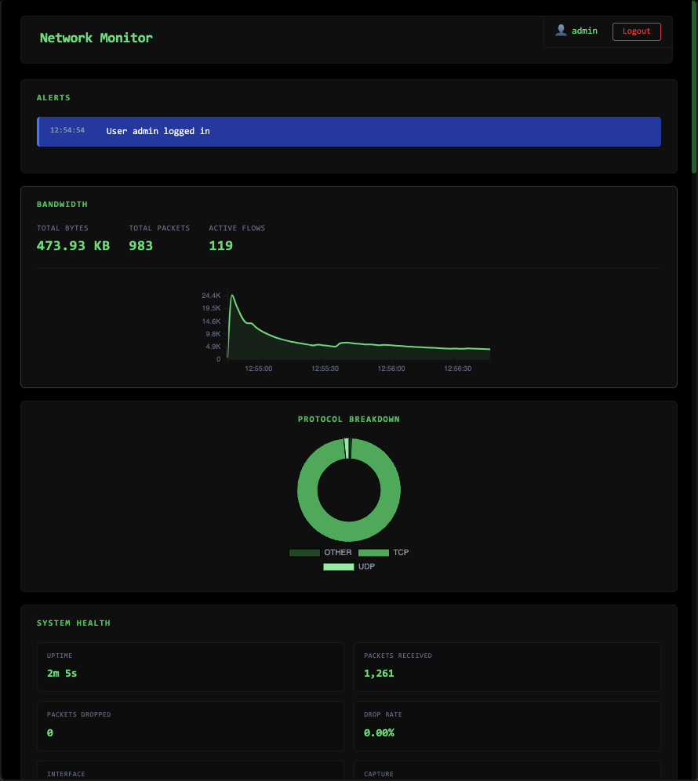
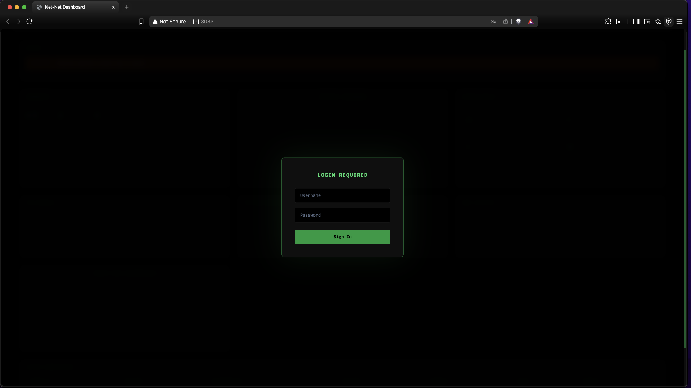

# net-net

[](https://github.com/humanauction/net-net/actions/workflows/ci.yml)
[](https://codecov.io/gh/humanauction/net-net)

Real-Time Network Monitor with Web Dashboard

## Overview

A high-performance, modular network monitoring daemon written in C++17 that captures packets, tracks active connections, and aggregates bandwidth and protocol statistics in real-time. Features a modern web-based dashboard with live visualizations, session-based authentication, and a REST API for programmatic access.

**Key Features:**

- 📊 Real-time bandwidth visualization (D3.js line charts)
- 🔐 Secure session-based authentication with bcrypt
- 🌐 Modern web dashboard with live updates
- 📈 Protocol breakdown pie charts (TCP/UDP/OTHER)
- 🔌 Active connection tracking and display
- 🛡️ Privilege dropping for security
- 📦 SQLite persistence for historical data
- ⚡ Sub-second latency metrics

---

## 🚀 Quick Start

### Prerequisites

- **macOS/Linux** with libpcap installed
- **C++17** compiler (clang++ or g++)
- **CMake 3.16+**
- **Python 3.x** with pip (for integration tests)
- **Root/sudo access** (for packet capture)
- **envsubst** (usually included with `gettext`)

### Build & Run

```bash
# Clone repository
git clone https://github.com/humanauction/net-net.git
cd net-net

# Build daemon
make clean
make build

# Start daemon with live capture (requires sudo)
make demon

# Or start with environment variables for your interface
NETNET_IFACE=en0 NETNET_BPF_FILTER="" make demon

# Open dashboard in browser
open http://localhost:8082
```

### Using the Makefile

The project includes a comprehensive Makefile with the following targets:

| Command | Description |
| ------- | ----------- |
| `make` | Build all binaries |
| `make build` | Build the project |
| `make rebuild` | Clean and rebuild |
| `make demon` | Run daemon with live capture (requires sudo) |
| `make demon-stop` | Stop running daemon |
| `make demon-ol` | Run daemon with PCAP file replay |
| `make test` | Run ALL tests (C++ + Python) |
| `make test-cpp` | Run C++ tests only |
| `make test-python` | Run Python integration tests only |
| `make coverage` | Generate coverage report |
| `make coverage-html` | Generate HTML coverage report |
| `make clean` | Clean all build artifacts |
| `make venv` | Set up Python virtual environment |
| `make config-ci` | Generate CI config from template |

### Environment Variables

Configure capture settings via environment variables:

```bash
export NETNET_IFACE=en0          # Network interface (default: en0)
export NETNET_USER=nobody        # User for privilege drop
export NETNET_GROUP=nobody       # Group for privilege drop
export NETNET_BPF_FILTER=""      # BPF filter (empty = capture all)
```

### Default Credentials

- **Username:** `admin`
- **Password:** `adminpass`

⚠️ **Change default passwords in production!** See [Configuration](#️-configuration) section.

---

## 📸 Screenshots

### Dashboard Overview



*Real-time bandwidth monitoring with protocol breakdown and active connections*

### Login Screen


*Secure session-based authentication*

---

## 🏗️ Architecture

```text
┌─────────────────────────────────────────────────────┐
│                  Web Dashboard                      │
│         (HTML/CSS/JavaScript + D3.js)               │
└──────────────────────┬──────────────────────────────┘
                       │ REST API (HTTP)
┌──────────────────────▼──────────────────────────────┐
│                NetMonDaemon (C++)                   │
│   ┌─────────────────────────────────────────────┐   │
│   │  SessionManager (bcrypt + SQLite)           │   │
│   └─────────────────────────────────────────────┘   │
│   ┌─────────────────────────────────────────────┐   │
│   │  REST API (cpp-httplib)                     │   │
│   │  • /login, /logout, /metrics                │   │
│   │  • /control/{start,stop,reload}             │   │
│   └─────────────────────────────────────────────┘   │
│   ┌─────────────────────────────────────────────┐   │
│   │  StatsAggregator (Metrics)                  │   │
│   └─────────────────────────────────────────────┘   │
│   ┌─────────────────────────────────────────────┐   │
│   │  ConnectionTracker (Flow State)             │   │
│   └─────────────────────────────────────────────┘   │
│   ┌─────────────────────────────────────────────┐   │
│   │  Parser (Ethernet/IPv4/TCP/UDP/ICMP)        │   │
│   └─────────────────────────────────────────────┘   │
│   ┌─────────────────────────────────────────────┐   │
│   │  PcapAdapter (libpcap wrapper)              │   │
│   └─────────────────────────────────────────────┘   │
└─────────────────────┬───────────────────────────────┘
                      │
              ┌───────▼─────────┐
              │     Network     │
              │     Interface   │
              │   (en0, eth0)   │
              └─────────────────┘
```

See [docs/design.md](docs/design.md) for detailed architecture documentation.

---

## 📋 Project Structure

```text
net-net/
├── src/                                # C++ source code
│   ├── core/                           # Core monitoring logic
│   │   ├── Parser.{cpp,h}              # Packet parsing (Ethernet→IP→TCP/UDP)
│   │   ├── ConnectionTracker.{cpp,h}   # Flow tracking
│   │   ├── StatsAggregator.{cpp,h}     # Metrics aggregation
│   │   ├── StatsPersistence.{cpp,h}    # SQLite storage
│   │   ├── SessionManager.{cpp,h}      # Authentication
│   │   └── PacketMeta.h                # Packet metadata structures
│   ├── net/                            # Network adapters
│   │   └── PcapAdapter.{cpp,h}         # libpcap wrapper
│   └── daemon/                         # Daemon implementation
│       ├── Main.cpp                    # Entry point
│       ├── NetMonDaemon.{cpp,h}        # Main daemon class
│       └── httplib.h                   # HTTP server (header-only)
├── www/                                # Web dashboard
│   ├── index.html                      # Dashboard UI
│   ├── style.css                       # Styling
│   └── app.js                          # JavaScript (D3.js + Chart.js)
├── include/net-net/vendor/             # Third-party code
│   ├── bcrypt.{cpp,h}                  # Password hashing
│   └── uuid_gen.{cpp,h}                # Session token generation
├── tests/                              # Test suites
│   ├── unit/                           # C++ unit tests (GoogleTest)
│   ├── integration/                    # Python integration tests
│   └── fixtures/                       # Test PCAP files
├── docs/                               # Documentation
│   ├── design.md                       # Architecture overview
│   ├── api.md                          # REST API reference
│   ├── EntityRelationshipDataModel.md  # Database schema
│   ├── packetFlowDiagram.md            # Packet processing flow
│   └── securityChecklistReview.md      # Security audit
├── examples/                           # Configuration templates
│   ├── sample-config.yaml              # Template with env vars
│   └── sample-config.ci.yaml           # Generated CI config
├── CMakeLists.txt                      # Build configuration
├── Makefile                            # Build wrapper
└── README.md                           # This file
```

---

## ⚙️ Configuration

Configuration uses YAML with environment variable substitution. The Makefile generates `sample-config.ci.yaml` from `sample-config.yaml` using `envsubst`.

### Interface Settings

```yaml
interface:
  name: "${NETNET_IFACE}"         # Network interface (e.g., en0, eth0)
  promiscuous: true               # Capture all packets on segment
  snaplen: 65535                  # Max bytes per packet
  timeout_ms: 1000                # Read timeout
  bpf_filter: "${NETNET_BPF_FILTER}"  # BPF filter (empty = all traffic)
```

### Offline Mode (PCAP Replay)

```yaml
offline:
  file: "/path/to/capture.pcap"   # Uncomment to replay PCAP file
```

### API Settings

```yaml
api:
  enabled: true
  host: "0.0.0.0"                 # Listen address
  port: 8082                      # Listen port
  token: "your_secure_token"      # For /control endpoints
  session_expiry: 3600            # Session timeout (seconds)
```

### User Credentials

```yaml
users:
  - username: "admin"
    password: "$2a$12$..."        # bcrypt hash
  - username: "user"
    password: "$2a$12$..."
```

**Generate bcrypt hashes:**

```bash
python3 -c "import bcrypt; print(bcrypt.hashpw(b'yourpassword', bcrypt.gensalt()).decode())"
```

### Connection Tracking

```yaml
tracking:
  idle_timeout: 300               # Remove idle connections after N seconds
  cleanup_interval: 60            # Cleanup check interval
```

### Statistics

```yaml
stats:
  window_size: 60                 # Aggregation window (seconds)
  history_depth: 24               # Number of windows to retain
```

### Database

```yaml
database:
  path: "/tmp/netnet.db"          # SQLite file path
  retention_days: 7               # Data retention period
```

### Privilege Drop (Security)

```yaml
privilege:
  drop: true
  user: "${NETNET_USER}"
  group: "${NETNET_GROUP}"
```

### Logging

```yaml
logging:
  level: "debug"                  # debug, info, warn, error
  file: ""                        # Empty = stdout
  timestamps: true
```

---

## 🔌 REST API

### Authentication Endpoints

#### POST `/login`

Authenticate user and receive session token.

**Request:**

```json
{
  "username": "admin",
  "password": "adminpass"
}
```

**Response:**

```json
{
  "token": "550e8400-e29b-41d4-a716-446655440000",
  "username": "admin",
  "expires_in": 3600
}
```

#### POST `/logout`

Invalidate session token.

**Headers:**

```http
X-Session-Token: <token>
```

---

### Metrics Endpoints

#### GET `/metrics`

Retrieve current network statistics.

**Headers:**

```http
X-Session-Token: <token>
```

**Response:**

```json
{
  "timestamp": 1732656147000,
  "window_start": 1732656140,
  "total_bytes": 1048576,
  "total_packets": 256,
  "bytes_per_second": 104857,
  "protocol_breakdown": {
    "TCP": 900000,
    "UDP": 148576,
    "OTHER": 0
  },
  "active_flows": [
    {
      "src_ip": "192.168.1.100",
      "src_port": 54321,
      "dst_ip": "142.250.80.46",
      "dst_port": 443,
      "protocol": "TCP",
      "bytes": 15360,
      "packets": 45
    }
  ]
}
```

---

### Control Endpoints

#### POST `/control/start`

Start packet capture.

#### POST `/control/stop`

Stop packet capture.

#### POST `/control/reload`

Reload configuration file.

**Headers (all control endpoints):**

```http
Authorization: Bearer <api_token>
```

See [docs/api.md](docs/api.md) for complete API documentation.

---

## 🧪 Testing

### Run All Tests

```bash
make test
```

### C++ Unit Tests Only

```bash
make test-cpp
```

### Python Integration Tests Only

```bash
make test-python
```

### Coverage Reports

```bash
# Terminal summary
make coverage

# HTML report (opens in browser)
make coverage-html
```

**Test Suites:**

- `test_parser` - Packet parsing logic
- `test_pcap_adapter` - Capture adapter
- `test_connection_tracker` - Flow tracking
- `test_stats_aggregator` - Metrics aggregation
- `test_session_manager` - Authentication

---

## 🔒 Security

### Implemented Safeguards

- ✅ **Privilege Dropping:** Daemon drops to configured user/group after opening capture device
- ✅ **bcrypt Password Hashing:** All passwords hashed with salt
- ✅ **Session Tokens:** UUID-based tokens, SQLite-backed, configurable expiry
- ✅ **Rate Limiting:** Control endpoints limited to 1 request per 2 seconds per IP
- ✅ **Input Validation:** BPF filter sanitization, JSON schema validation
- ✅ **No Credential Logging:** Passwords never logged or displayed
- ✅ **HTTPS Ready:** Designed for reverse proxy (nginx/Caddy) with TLS

### Production Checklist

- [ ] Change default passwords
- [ ] Use strong API tokens (32+ characters)
- [ ] Enable HTTPS via reverse proxy
- [ ] Restrict API access by IP/firewall
- [ ] Run daemon as dedicated user
- [ ] Enable audit logging
- [ ] Review [`docs/securityChecklistReview.md`](docs/securityChecklistReview.md)

---

## 🐛 Troubleshooting

### No Metrics/Data Showing

```bash
# Check you're capturing on the right interface
ifconfig | grep -B1 "inet "

# Run with empty BPF filter to capture ALL traffic
NETNET_IFACE=en0 NETNET_BPF_FILTER="" make demon
```

### Permission Denied

```bash
# Packet capture requires root
sudo ./build/netnet-daemon --config examples/sample-config.ci.yaml

# Or use make target (includes sudo)
make demon
```

### Port Already in Use

```bash
# Kill existing daemon
sudo pkill netnet-daemon

# Check what's using the port
lsof -i :8082
```

### Interface Not Found

```bash
# List available interfaces (macOS)
ifconfig | grep -E "^[a-z]" | cut -d: -f1

# Common interfaces:
# macOS WiFi: en0
# macOS Ethernet: en1
# Linux: eth0, wlan0
# Loopback: lo0 (macOS), lo (Linux)
```

### Dashboard Shows "Connection Refused"

1. Check daemon is running: `ps aux | grep netnet-daemon`
2. Check port: `lsof -i :8082`
3. Verify config has `host: "0.0.0.0"` not `"localhost"`

### Session Token Invalid

```bash
# Clear browser localStorage (F12 console)
localStorage.clear()
```

---

## 📚 Documentation

- [Architecture & Design](docs/design.md)
- [REST API Reference](docs/api.md)
- [Database Schema](docs/EntityRelationshipDataModel.md)
- [Packet Processing Flow](docs/packetFlowDiagram.md)
- [Security Audit](docs/securityChecklistReview.md)

---

## 🛠️ Development Roadmap

### ✅ Stage 0: Planning & Design (Complete)

- Architecture design
- Entity-relationship diagram
- Packet flow diagram
- Config schema definition

### ✅ Stage 1: Core Capture Layer (Complete)

- PcapAdapter implementation
- BPF filter validation
- Unit tests with mocked adapter
- Integration tests with PCAP files

### ✅ Stage 2: Parser & Connection Tracker (Complete)

- Multi-protocol parser (Ethernet/IPv4/IPv6/TCP/UDP/ICMP)
- 5-tuple flow tracking
- Connection state machine
- Per-flow throughput counters

### ✅ Stage 3: Stats Aggregation & Persistence (Complete)

- Rolling-window metrics
- In-memory ring buffer
- SQLite persistence
- Configurable aggregation windows

### ✅ Stage 4: CLI Daemon & REST API (Complete)

- NetMonDaemon headless mode
- REST API with cpp-httplib
- Session-based authentication
- Rate limiting
- Privilege dropping
- Configurable logging

### ✅ Stage 5: Web Dashboard & UI (Complete)

- HTML/CSS/JavaScript frontend
- Real-time bandwidth chart (D3.js)
- Protocol breakdown pie chart (Chart.js)
- Active connections table
- Login/logout UI
- Session token management

### ✅ Stage 6: Hardening, CI, Docs (Complete)

- CI/CD pipeline (GitHub Actions)
- Code coverage reporting (gcov/gcovr)
- Comprehensive Makefile
- Environment variable configuration
- Documentation updates

---

## 🤝 Contributing

Contributions welcome! Please:

1. Fork the repository
2. Create a feature branch (`git checkout -b feature/amazing-feature`)
3. Commit changes (`git commit -m 'Add amazing feature'`)
4. Push to branch (`git push origin feature/amazing-feature`)
5. Open a Pull Request

**Before submitting:**

- Run tests: `make test`
- Check formatting: `clang-format -i src/**/*.cpp src/**/*.h`
- Update documentation if needed

---

## 📝 License

This project is licensed under the MIT License - see [LICENSE](LICENSE) file for details.

---

## 🙏 Acknowledgments

- [libpcap](https://www.tcpdump.org/) - Packet capture
- [cpp-httplib](https://github.com/yhirose/cpp-httplib) - HTTP server
- [yaml-cpp](https://github.com/jbeder/yaml-cpp) - YAML parsing
- [nlohmann/json](https://github.com/nlohmann/json) - JSON handling
- [GoogleTest](https://github.com/google/googletest) - Unit testing
- [D3.js](https://d3js.org/) - Data visualization
- [Chart.js](https://www.chartjs.org/) - Pie charts
- [bcrypt](https://en.wikipedia.org/wiki/Bcrypt) - Password hashing

---

## 📧 Contact

- **GitHub Issues:** [github.com/humanauction/net-net/issues](https://github.com/humanauction/net-net/issues)
- **Email:** [humanauction@gmail.com](mailto:humanauction@gmail.com)
