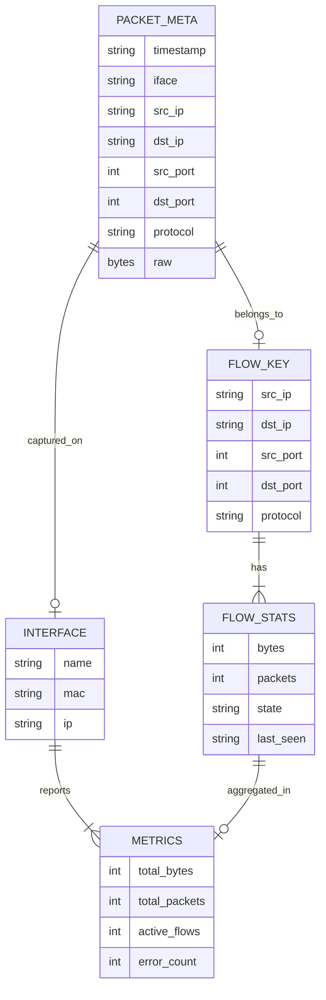

# Entity Relationship Data Model

```mermaid
erDiagram
    PACKET_META {
        string timestamp
        string iface
        string src_ip
        string dst_ip
        int src_port
        int dst_port
        string protocol
        bytes raw
    }
    FLOW_KEY {
        string src_ip
        string dst_ip
        int src_port
        int dst_port
        string protocol
    }
    FLOW_STATS {
        int bytes
        int packets
        string state
        string last_seen
    }
    INTERFACE {
        string name
        string mac
        string ip
    }
    METRICS {
        int total_bytes
        int total_packets
        int active_flows
        int error_count
    }

    PACKET_META ||--o| INTERFACE : "captured_on"
    PACKET_META ||--o| FLOW_KEY : "belongs_to"
    FLOW_KEY ||--|{ FLOW_STATS : "has"
    INTERFACE ||--|{ METRICS : "reports"
    FLOW_STATS ||--o| METRICS : "aggregated_in"
```
